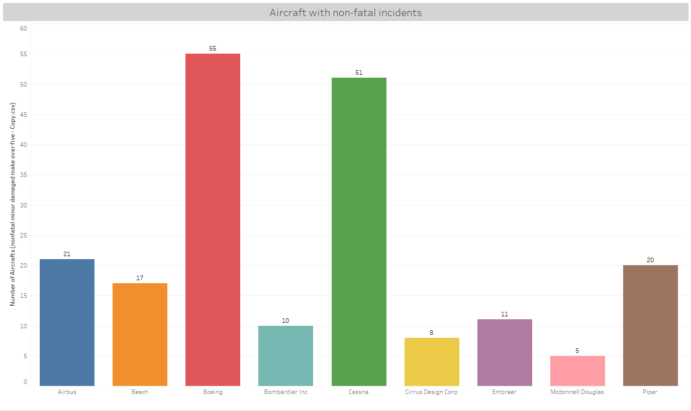
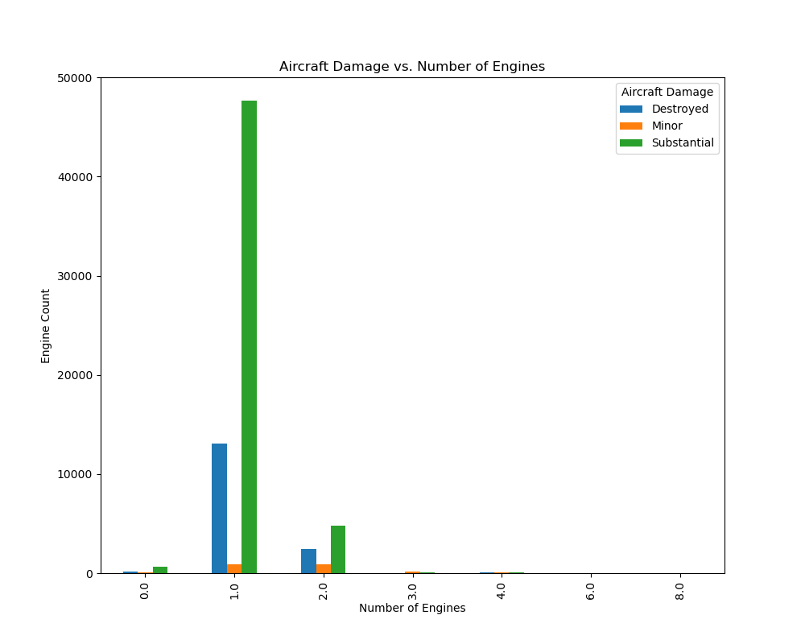
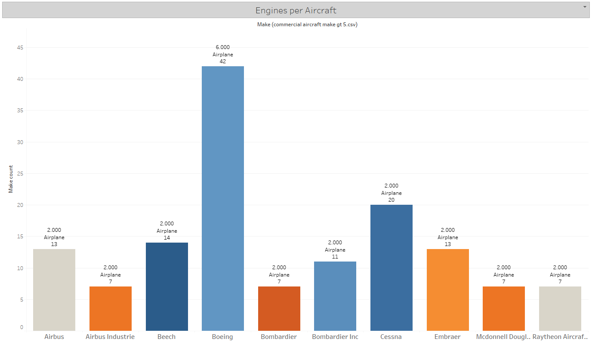
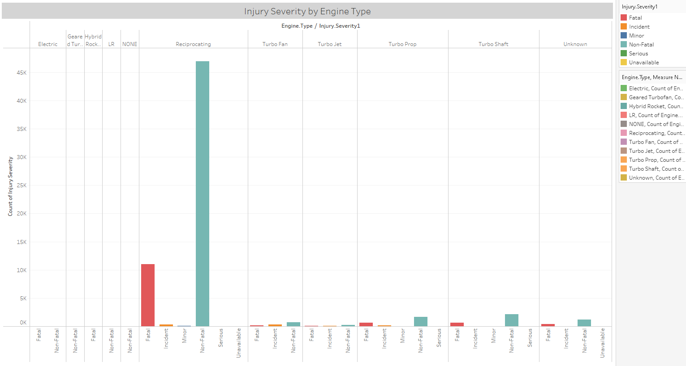

# Aviation Accident Database Analysis

## Introduction  

This repository contains a dataset obtained from Kaggle, comprising of avaiation accidents. The dataset. The dataset contains a wide range of information regarding aviation accidents, including factors such as location, date, injuries, type of aircraft, and fatalities among other information.

## Business overview: Aircraft Purchase Strategy Based on Safety Analysis

This repository focuses aims to provide insights into incorporating accident data and safety features analysis into the aircraft procurement strategy. Analyzing accident data and understanding safety features can significantly inform decision-making processes regarding aircraft purchase.

## Dataset Description

The dataset consists of a single file named 'AviationData.csv'. It contains the following columns:

* Event Id: A unique identifier for each accident event.
* Investigation Type: Categorization of the type of investigation conducted.
* Accident Number: Unique identidies assigned by the NTSB to a paricular accident
* Event Date: Date of the accident.
* Location: Location of the accident.
* Country: Country in which the accident took place.
* Latitude: Latitude coordinates of the accident location.
* Longitude: Longitude coordinates of the accident location.
* Injury Severity: Severity of injuries sustained in the accident.
* Aircraft Category: Category of aircraft involved(i.e.,Airplane, Helicopter)
* Make: Manufacturer of aircraft
* Model: Model of the aircraft
* Number of Engines: Total number fo engines installed on the aircraft.
* Engine Type: Type of engines installed on the aircraft.
* Purpose of Flight: Purpose of the flight at the time of the accident.
* Total Fatal Injuries: Total number of fatal Injuries reported
* Total Serious Injuries: Total number of serious injuries reported
* Total Minor Injuries: Total number of minor injuries reported
* Total Uninjured: Total number of uninjured individuals reported

## Analysis Goal

The primary goal of this analysis is to explore the provided aviation accident dataset to gain insights into various of aviation accidents, to determine the best three options to purchase. Key areas of analysis include:

1. Injury Analysis: Explore the severity and distribution of injuries resulting from accidents.
2. Aircraft Analysis: Examine characteristics and factors related to differnt aircrafts involved in accidents.

## Mehodology

Follow the steps below, to start your analysis:

1. Download the dataset: Download the 'AviationData.csv' file from this repository or you can go directly to [AviationData](https://www.kaggle.com/datasets/khsamaha/aviation-accident-database-synopses)

2. Set up your environment: Setup your prefered environment for data analysis. This repository uses Python with the Pandas, Numpy, and Matplotlib libraries.

3. Explore the Data: Load the dataset into your environment and begin exploring the columns and data distribution.

4. Perform Analysis: Utilize various stastical and visualization techniques to conduct desired analysis.

5. Document Findings: Document your findings and insights obtained from the analysis

6. Present Findings: Using visualization tool, illustrate my findings. You can locate my tableau dashboard here: [AircraftAnalysisDashboard](https://public.tableau.com/views/AircraftAnalysisproject-1/Aircraftpurchasedashboard?:language=en-US&publish=yes&:sid=&:display_count=n&:origin=viz_share_link)

## Results

#### Accident Analysis

Assessing damage categories that fall under the **Non-Fatal** and **Minor** Categories we found the following:

* Accident Frequency: Determine the frequenct of accidents over time.

* Accident Severity

* Number of Engines

## Next Steps

The safety features provided in the data, provides a better look at which aircraft has the safest number of engines for aircrafts
Number of eninges: **2.0** and more. 

The best engine for aircrafts: **Reciprocating**

Optimal weather conditions: **VMC**

### Conclusion

In condlusion, after assessing the information, focusing on safety features, accidents, and injury. We are able to concluse that best aircrafts available for commercial and private use are:

1. **Boeing**: commercial use
2. **Cessna**: private use
3. **Airbus**: commercial and prviate use

* As a bonus, we can also choose aircrafts manufactures from **Piper** for **private** use.

## Contributors

* Orangel Mendez - omendez30@gmail.com
